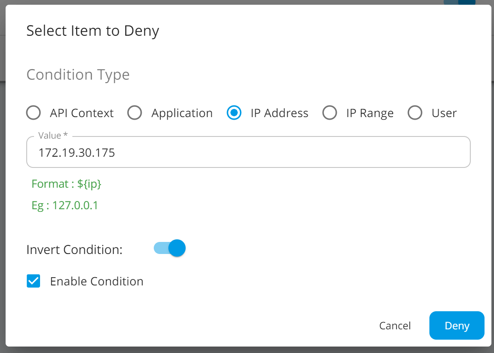
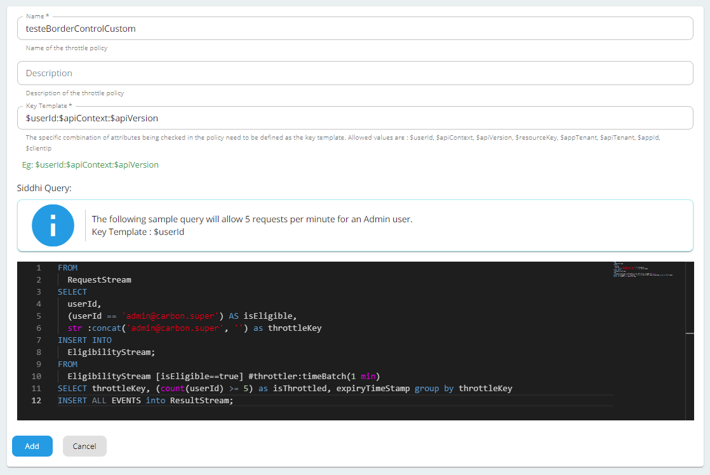
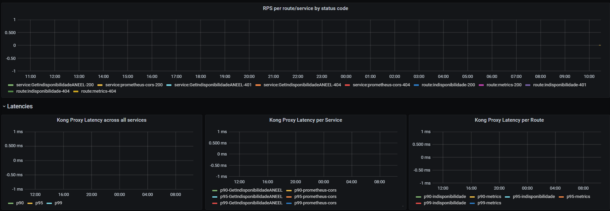
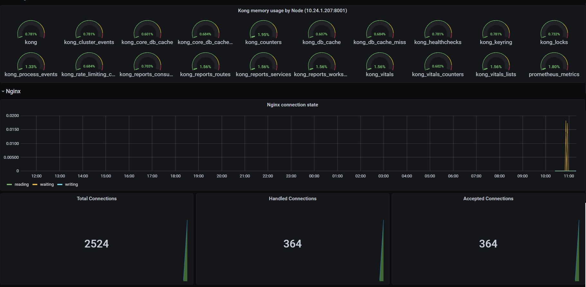
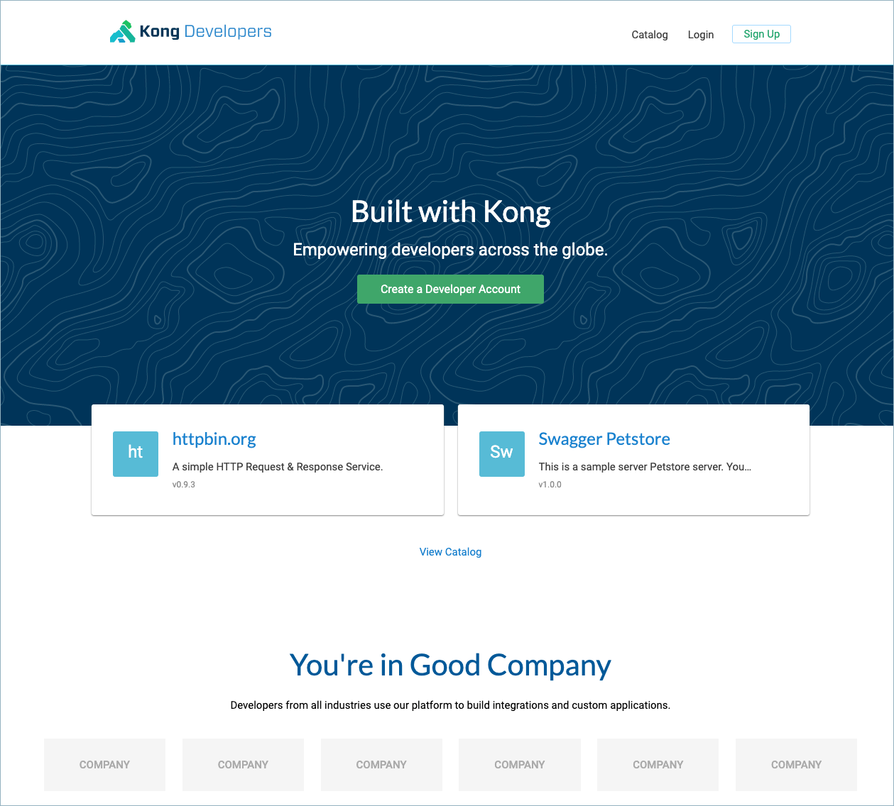
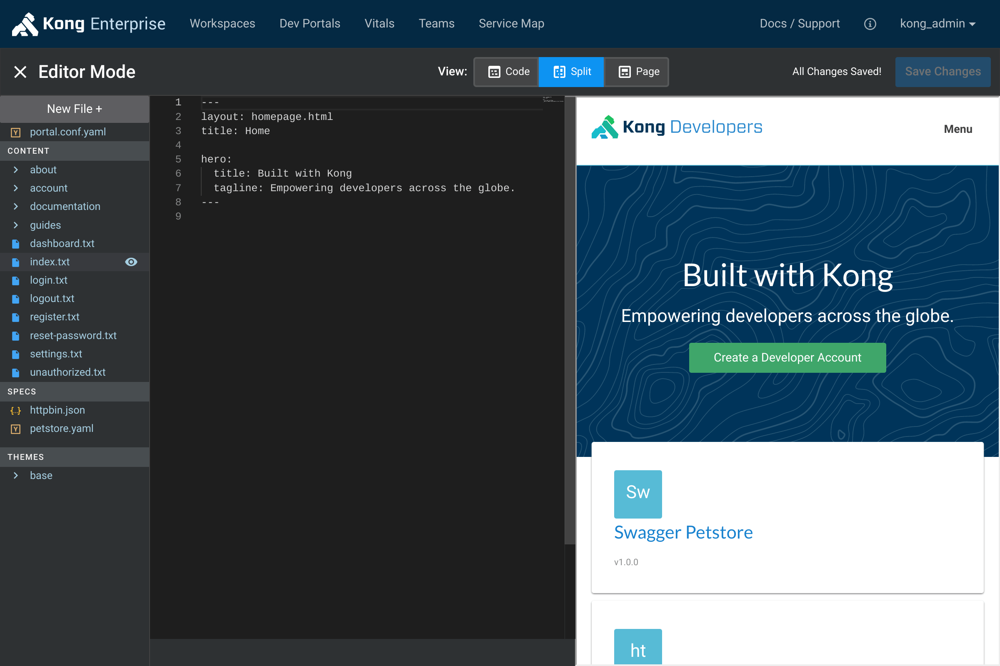

# Primeiras considerações

## Solução

Como o desejo é evitar o modelo do IIB tentaremos evitar delegar muitas responsabilidades ao API gateway, a fim de não replicar os mesmos problemas enfrentados.

## Performance

Sempre é desejável obter o máximo de desempenho com o menor uso de recursos e num sistema será muito acessado, isto é primordial. Adicionar muitos passos ou chamadas bloqueantes deve ser evitados. Além disso o que puder ser cacheado ou definido estaticamente garante uma performance mais consistente.

Por exemplo, adicionar um item no cache do Redis, pode não ser necessário ser bloqueante, já que a próxima consulta pode demorar alguns segundos. Claro que se o intervalo fo mais curto outras alternativas podem ser necessárias.

## Kong

Possui uma estrutura de plugins que podem ser aplicados com alta granularidade, e flexível de maneira que podemos interceptar as solicitações e implementar as integrações.

Existem além dos plugins fornecidos pela Kong, outros open-source que podemos incluir na solução. Plugins podem ser escritos em Lua ou Go. Possui um [hub](https://docs.konghq.com/hub/) mantido pela Kong de plugins da Kong e de terceiros.

A partir da versão 2.3 alguns recursos do Kong Enterprise passaram a ser gratuitos (ex: ferramenta de administração *Kong Manager*). Alguns ainda fazem parte do processo de assinatura chamado *Kong Konnect* (ex: DevPortal, plugins avançados).

## WSO2

Possui uma estrutura poderosa chamada de [message mediation](#message-mediation) capaz de manipular as solicitações ao gateway, de maneira que é o método que consideramos apropriado para as integrações. Escritos em Java.

Possui além do gateway, um microgateway, destinado a soluções baseadas em micro serviços e implantadas possivelmente em kubernetes. Este produto não foi avaliado dentro do plano original de produtos.

# POP

## Validação da assinatura do token

### Kong 

> Contemplado na PoC

É necessário cadastrar a chave pública do POP como credencial de um consumer. Um consumer pode ser associado a um ou mais grupos. Esses grupos podem ser associados a uma rota/serviço e permitidos (whitelist) ou bloqueados (blacklist).
Pode ser automatizado (chamada REST).

Pros/Contras: Mais simples

### WSO2 

> Contemplado parcialmente na PoC, a abordagem 1 abaixo

Possui duas abordagens:

1. importando a chave pública no formato de certificado X509 na store de certificados do java (*.jks). É possível ter somente um certificado padrão, e se for necessário mais de uma chave por ambiente é necessário incluir no token JWT o claim **kid** no header com identificadores diferentes por ambiente. Pode ser automatizado (script shell/Ansible). É necessário reiniciar o serviço.

2. disponibilizando um endpoint http no formato jwks. É necessário incluir no token JWT o claim **kid** no header. Solução simples, mas fluxo mais complexo, depende de disponibilizar o conteúdo HTTP (estático), mas pode ser atualizado em processo independente do serviço do gateway.

Possui uma funcionalidade de cache de tokens que otimiza o processamento das chamadas. No entanto exige que o campo possua um identificador único de token, um claim chamado [**jti**](https://tools.ietf.org/html/rfc7519#section-4.1.7). Este cache pode ser desabilitado se não for possível gerar o identificador.

Também obriga a identificação do chamador, com um identificador do chamador pelo claim **azp**. Este controle foi possível desabilitar, razão pela qual ainda não conseguimos integrar com o token do POP. (O nome do claim exato pode ser modificado via código Java, extendendo uma classe do próprio WSO2).

Pros/Contras: Modelo mais monolítico

## Validação dos claims do token

Este processo consideramos regras estáticas que serão definidas de maneira semelhante a isto:

```properties
[ServicoXYZ]
nome-da-claim=conteudo-esperado
outra-claim=conteudo-esperado
```

Em ambos os casos **teríamos que definir como identificamos o serviço sendo chamado**

### Kong

> Não contemplado na PoC

Não possui um validador arbitrário de claims. Precisa ser implementado via plugin. Já existem plugins que podem atender a demanda. O plugin leria o arquivo com as regras e bloqueia os que não atendam à regra. 

### WSO2

> Avaliar

Já possui uma infra estrutura mais completa de validação de claims, porém não temos a percepção se esta infra estrutura atende. A implementação do [Key Manager](#key-manager) possivelmente resolva o problema.

Em último caso poderia ser implementado como um [message mediator](#message-mediation) que recusa os claims interceptando. Esta solução precisaria ser validada.

## Chamada da serviço (API REST do POP)

O POP possui uma interface REST utilizada para diversos fins. A possibilidade de chamar o serviço do POP de dentro do fluxo do api gateway parece ser técnicamente possível. Abaixo os fluxos mapeados.

Pontos a serem considerados:

1. Ponto de falha caso o endpoint do POP fique indisponível. Podemos detalhar se este cenário já ocorre hoje, e qual o comportamento.
2. Usar a infra estrutura do gateway (ex: Memória/CPU) para algum processamento. Facilita a implementação mas deixa o processo mais complexo.
3. Usar algum serviço externo para fazer todos os fluxos desejados (ex: chamadas ao POP e outras validações e integrações) - junto com o item anterior.
4. Usar algum serviço de cache de alta disponibilidade (ex: Redis). É possível executar regras simples em script Lua dentro do Redis.

### Validação de permissões do usuário

> Não contemplado na PoC

Dentro dos programas do IIB existem chamadas que validam permissões específicas do usuário chamador à determinados programas. Estas permissões são definidas no ferramental do POP e validadas em tempo de execução.

Da maneira que é feito hoje estas permissões ficam fixas dentros dos programas do IIB de maneira que entendemos ser possível **ter regras estáticas** de maneira semelhante a isto:

```properties
[Rota_ou_Servico_XYZ]
destino=programa_ABC
usuario_origem=claim_do_token_original
validacoes=regra1;regra2;regra3
```
Poderíamos ter um processamento que carregasse em memória ou de maneira otimizada todas as configurações possíveis.

### Chamada da obtenção de tokens

> Não contemplado na PoC

Em alguns cenários é necessário chamar algum dos serviços ONS com um token diferente do original do chamadar. Isto é feito hoje pelo programa IIB com regras fixas de qual sistema de destino precisa ser chamado e qual usuário e senha (parametrizáveis).

Entendemos que as regras são estáticas nos programas de maneira que podemos parametrizar estas configurações de maneira semelhante a isto:

```properties
[Sistema_XYZ]
usuario=usr_svc_sistema_xyz
senha=p@ssW0rd

[Rota_para_o_sistema_XYZ]
token=Sistema_XYZ
```

Estes tokens serão armazenados para serem reutilizados em outras chamadas, junto com seu respectivo *refresh token*. Não seria necessário em princípio que esta chamada seja feita em tempo de execução de um serviço no gateway. **Estes tokens poderiam ser pré armazenados.** A discussão deste *cache* será feita mais adiante.

### Revalidação dos *refresh tokens*

> Não contemplado na PoC

*Refresh tokens* são uma provisão do JWT para revalidar um token existente após a expiração do token original. Isto permite manter o token válido por mais tempo, desde que seja feito dentro do tempo de revalidação.

Este fluxo somente depende de uma chamada ao endpoint do POP de maneira que o necessário é simplesmente revalidar depois que o token original expirou, passando as informações ao *endpoint*.

Vale notar que este fluxo **não precisa estar necessariamente dentro do gateway**. Delegar esta responsabilidade para um serviço paralelo parece mais razoável, de maneira que o gateway somente repasse as necessidades, não sendo necessário atuar em tempo de execução da chamada do gateway.

### Chamadas externas ao POP

> Não contemplado na PoC

De maneira geral, não importando a solução escolhida, seria mais interessante que as informações estáticas fossem pré carregadas e disponibilizadas em memória ou com um serviço paralelo ao gateway, que faria o mesmo processo. 

Do ponto de vista de performance chamadas externas sempre devem ser evitadas, mas não sendo possível, devemos mitigar estes acessos, possivelmente em um ponto único.

### Kong

Implementar chamadas HTTP nos plugins do Kong é possível, mas não é tão trivial. 
As implementações de plugins precisam ser feitas preferencialmente em Lua ou possivelmente em GO, e são executadas no contexto do processo do gateway, de maneira que externalizar essas regras parece fazer mais sentido, se forem muito complexas. Além disso as bibliotecas de suporte à estes ambientes são limitadas dado que atualmente não são tão populares, ainda que isto esteja em evolução.

Um exemplo de chamador HTTP pode ser encontrado em https://github.com/pantsel/kong-middleman-plugin

Em [Plugins](#plugins) temos uma discussão mais aprofundada da arquitetura.

### WSO2

Como a solução é usar os mediators, esses *custom handlers* são escritos em Java o que permite um uso de ferramental e bibliotecas mais maduras, mas no entanto exigem uma preparação e fluxo de desenvolvimento mais sofisticado.

Uma discussão de como implementar estes *custom handlers* prode ser encontrada em https://apim.docs.wso2.com/en/latest/develop/extending-api-manager/extending-gateway/writing-custom-handlers/

# Transformação dos *requests*

Efetuar transformações dos requests é uma necessidade a ser contemplada. O IIB possui uma linguagem e ferramental com suporte à esta funcionalidade, por ser caso de uso dos ESBs em geral. No entanto no caso do API gateway isso é possível mas não de maneira tão prática, estruturada e conectada ao fluxo de desenvolvimento.

Estamos prevendo somente transformações simples e previsíveis, que algum código genérico possa fazer. Mesmo estes casos precisamos endereçar quais as necessidades em particular, e definir com as equipes de desenvolvimento e arquitetura a abordagem que faz mais sentido.

Kong e WSO2 possuem já alguns plugins com funcionalidade embarcada (REST, GraphQL, SOAP), que podem ser usados. No entanto fica fora do escopo uma avaliação se estas soluções prontas atenderão todas as demanadas da ONS. 

Alguns plugins/mediators prontos são *open source* de maneira que podem ser extendidos, além dos plugins disponíveis na internet.

## Abordagem genérica

No caso de uma abordagem mais genérica, poderíamos buscar solucionar o problema da seguinte maneira:

1. Mapear todas as soluções necessárias (ex: sistema XYZ com protocolo fora do padrão do mercado, com diversas chamadas)
2. Construir o plugin(s) ou mediator(s) parametrizável que atenda todas as chamadas possíveis
3. PoC de integração com o gateway
4. Fluxo de testes e publicação

## Kong

### Transformações genéricas

> Não contemplado na PoC

Possui um plugin simples que faz modificações pré estabelecidas (ex: adicionar headers, trocar método HTTP, etc).

No entanto possui um plugin *advanced* que permite embarcar um script Lua para modificar a solicitação ou resposta com regras. **O plugin *advanced* só está disponível com a assinatura Konnect**.

Não possui nativamente uma funcionalidade de transformação sofisticada, no sentido de tratar funcionalidade comum às estes processos. Plugins podem ser desenvolvidos e aplicados.

Informações relevantes em https://konghq.com/blog/supporting-legacy-web-services-with-kong/

### GraphQL para REST

> Não contemplado na PoC

Possui um plugin licenciado [DeGraphQL](https://docs.konghq.com/hub/kong-inc/degraphql/) expondo este *endpoint* como serviço REST

## WSO2

### Transformações genéricas

A rigor o modelo de message mediation do WSO2 permite executar qualquer modificação na mensagem de maneira a atender qualquer demanda. Uma funcionalidade compatível com a estrutra de ESB do WSO2.

### REST para XML Soap

Vale notar que o produto já possui algumas funcionalidades de integração de padrões REST/WSDL. É possível transformar endpoints WSDL em REST automaticamente. Não avaliamos a qualidade ou aplicabilidade desta funcionalidade no entanto.

### XML Soap para REST

> Contemplado na PoC (Atualizar)

Permite converter a chamada SOAP em endpoint REST. Basta importar o contrato no formato WSDL que a conversão na entrada e na saída é feita de maneira automática.

> WSDL


> Importando WSDL 


> WSDL Request 200


Vale notar que alguns contratos conseguimos importar, mas devido a um tipo de dados incompatível, não conseguimos executar. 

### GraphQL para REST

> Não contemplado na PoC

Similar ao módulo SOAP, transforma um endpoint GraphQL em chamada REST. Parece ser útil para o caso de clientes sem suporte ao GraphQL, mas não avaliamos a qualidade e/ou potenciais problemas nestas conversões que possam impactar a decisão.

# Cache de tokens

> Não contemplado na PoC

Não é permitido que o mesmo usuário tenha mais de um token válido do POP ao mesmo tempo, por isso é necessário reutilizar o mesmo até a expiração final dele. Isto também vale para os *refresh tokens* destes tokens.

A solução imaginada (que já é utilizada no IIB) é de efetuar um cache dos tokens e reutilizá-los.

Não temos visibilidade de se é possível armazenar esses tokens de maneira global na memória da aplicação, mas como provavelmente teremos mais de uma instância do serviço do *gateway* em execução, teremos que ter um cache distribuído.

A solução que antecipamos como mais viável é ter um cache Redis que centralizará essa informação. Essa solução é padrão de mercado e entendemos que deve atender a esta demanda.

## Implementação

A comunicação com o Redis é feita via TCP por padrão na porta 6379. Existem vários comandos no Redis e bibliotecas diferentes nem sempre fornecem acesso à todos. No entanto, não nos parece que seja necessário nada além do padrão (ex: [GET](https://redis.io/commands/GET) ou [MGET](https://redis.io/commands/mget)).

### Kong

Acesso ao Redis precisa ser validado do Lua ou Go. A saber já existem *plugins* da própria Kong com acesso ao Redis. Pelo Lua existe o [redis-lua](https://github.com/nrk/redis-lua) e Go existe o [go-redis](https://github.com/go-redis/redis) entre outros https://redislabs.com/lp/redis-enterprise-go/.

### WSO2

Acesso ao Redis é feito por várias bibliotecas e o RedisLabs tem uma página com várias delas, além de exemplos de uso: https://redislabs.com/lp/redis-java/

# Border control (Controle de fronteira)

Estamos considerando neste assunto validações básicas de restrição de roteamento, usando por exemplo, endereços IPs.

## Kong

> Contemplado na PoC

Possui:

Plugin de restrição de IPs (https://docs.konghq.com/hub/kong-inc/ip-restriction/). Permite bloquear ou permitir IPs fixos ou faixas CIDR.

Plugins de restrição de tráfego ([Rate limit](https://docs.konghq.com/hub/kong-inc/rate-limiting/), [Rate limit advanced](https://docs.konghq.com/hub/kong-inc/rate-limiting-advanced/) - precisa de licença, [Response rate limit](https://docs.konghq.com/hub/kong-inc/response-ratelimiting/)).

Plugins de limitação das solicitações: [Request Size](https://docs.konghq.com/hub/kong-inc/request-size-limiting/) (por tamanho) e [Request Termination](https://docs.konghq.com/hub/kong-inc/request-termination) (por regra de conteúdo).

Estes plugins combinados permitem um controle fino das solicitações que podem entrar e restringir aquelas que sejam suspeitas (por exclusão das confiáveis, por exemplo).

Plugin de detecção de BOTs, no sentido de tráfego indesejado, por exemplo, BOTs do Google de indexação. Funciona por expressões regulares no campo User-Agent HTTP. Em (https://docs.konghq.com/hub/kong-inc/bot-detection/)

> Configuração de restrição por IP


> IP Permitido


> IP Restrito


## WSO2

> Contemplado na PoC

Existem diversas maneiras de bloqueio ou controle de acesso, chamadas *policies*.

- Advanced policies (aplicadas por método ou API)
- Application policies (aplicadas a aplicação do WSO2)
- Subscription policies (aplicadas aos assinantes de API do WSO2)
- Deny policies (aplicadas globalmente)
- Custom policies (aplicadas com toda a flexibilidade possível)

Este fluxo é configurado pela ferramenta admin.

### Advanced Policy

Possui uma funcionalidade bem completa, no sentido de bloquear ou restringir (throttling) o acesso por:
- IPs (fixo ou faixa/range)
- headers (valores fixos)
- valor(es) na querystring (valores fixos)
- claim(s) no JWT (valores fixos)

Para ter um bloqueio por API ou método, é possível usar a abordagem de throttling para 0 solicitações conforme o filtro pelos campos acima. Um 
detalhamento maior existe em (https://apim.docs.wso2.com/en/3.1.0/learn/rate-limiting/blacklisting-whitelisting/#!). 


### Deny Policy

Nega globalmente o acesso baseado em um atributo, por exemplo, um endereço IP, ou uma faixa (*range*):


Neste caso como a opção **invert condition** está ativa, bloquerá qualquer IP que **não** seja 172.19.30.175. 

Outras opções incluem: 

- API Context (ex: url base do cadastro: /servico/1.0.0)
- [Application](https://apim.docs.wso2.com/en/latest/learn/consume-api/manage-application/create-application/) (ex: usuário+aplicação do wso2)
- User (ex: usuário)

### Custom Policy

Mecanismo poderoso de bloqueio, baseado em um script de regra parecido com o das linguagens SQL. Por entendermos ser um recurso de uso avançado, não detalharemos as possibilidades, mas pela estrutura do script abaixo, é possível ter uma noção da complexidade permitida:



# Customs examination (Análise de ameaças) 

## Kong

> Não contemplado na PoC

Não possui uma funcionalidade específica para isto. É possível implementar via *plugin* e podemos nos inspirar (ou replicar) a funcionalidade que o WSO2 já oferece (a seguir).

O que vale menção é que a versão licenciada possui um produto chamado [*Kong Immunity*](https://docs.konghq.com/enterprise/2.3.x/immunity/overview/) que utiliza abordagem de *Machine Learning* para identificar padrões de acesso com o intuito de encontrar problemas, inclusive de segurança;

## WSO2

> Contemplado na PoC

Essencialmente são validadores por expressão regular no conteúdo da solicitação (chamados de *Threat protection* na documentação). Outras expressões personalizadas podem ser criadas para os cenários não previstos.

São ativados por configuração nos XMLs do gateway, exemplo em: https://apim.docs.wso2.com/en/latest/learn/api-security/threat-protection/bot-detection/.

# Monitoramento

## Métricas

### Kong

A versão licenciada possui um produto chamado [*Kong Vitals*](https://docs.konghq.com/enterprise/2.3.x/vitals/overview/) que já integra no *Kong Manager* *dashboards* de visualização das chamadas, além de exportar as métricas em formato CSV. É recomendado usar o InfluxDB como *backend* de armazenamento das métricas.

Além disso, permite expor via *plugin* em diversos formatos (ex: Prometheus, Datadog) que podem ser visualizados, por exemplo, no Grafana:

> Contemplado na PoC - acesso ao [dashboard do Grafana](http://10.24.1.207:8000/grafana), login/senha: admin/asdf1234





O dashboard padrão oficial da Kong, inclusive está disponível no site do Grafana: https://grafana.com/grafana/dashboards/7424. É o da imagem acima.

### WSO2

> Contemplado na PoC (Avaliar)

- Expõe métricas via protocolo JMX

- Possui um dashboard próprio que possui diversas métricas como :
  
  - histórico de latência de API
  - volume de tráfego
  - erros
  - Estatísticas como as APIs mais usadas, frequência de assinatura da API e inscrições do desenvolvedor ao longo do tempo. 

  Exemplo:
  
   

- TODO Ativar verssão com analitics 

## Logging

Captura de logs dos produtos no formato texto. É recomendável uma solução de centralização de logs para posterior consulta.

O nível de log depende da necessidade, e seria interessante alinhar com os logs já gravados pelas aplicações a fim de evitar duplicação dos dados.

### Kong

Possui diversos plugins que permitem a captura dos logs, além de permitir configurar o formato dos logs quando desejável. Desta maneira é possível processar paralelamente e extrair as métricas desejáveis.


### WSO2

> Contemplado na PoC

Por ser aplicação Java, usa a estrutura comum (log4j), com o funcionamento já conhecido de níveis de log (INFO,DEBUG,ERROR,etc) e de configuração dos appenders.

Por padrão grava na pasta <code>/repository/logs</code> alguns [logs relevantes](https://apim.docs.wso2.com/en/3.0.0/administer/product-administration/monitoring/logging/setting-up-logging/). Em resumo:
- Gateway (+erros)
- Carbon
- HTTP (+erros)
- Auditoria (audit)

## Tracing

> Não contemplado na PoC

No caso das aplicações que são construídas de maneira distribuída, fica difícil avaliar a performance de uma chamada composta de várias chamadas a diferentes serviços, olhando cada serviço individualmente. Neste caso é importante centralizar as diversas chamadas num contexto só. Isto é um dos componentes do que se costuma englobar em APM (Application Performance Monitoring).

Neste sentido as informações de *timing* das chamadas são coletadas e enviadas para um serviço coletor (ex: [Zipkin](https://zipkin.io/), [Jaeger](https://www.jaegertracing.io/), [OpenTracing](https://opentracing.io/)). Esta ferramenta agrega toda a coleta e consegue exibir o fluxo de chamadas interno.


Um exemplo de registro de tracing usando Zipkin

## Kong

Possui suporte a exportar *tracing* das execuções pelo plugin do Zipkin. 

Inclui os [headers b3](https://github.com/openzipkin/b3-propagation) de identificação das chamadas, e repassa aos serviços no *backend*.

## WSO2

Possui suporte ao OpenTracing com envio ao Jaeger e Zipkin, além de um gerador em formato de arquivo log. Também é possível personalizar outros formatos via extensibilidade em Java.

Detalhes em na [documentação do WSO2](https://apim.docs.wso2.com/en/latest/administer/logging-and-monitoring/monitoring/monitoring-with-opentracing/).

# API economy

> Não contemplado na PoC

Nenhuma das duas ferramentas tem um atenção muito voltada para esse ponto, não oferencendo funções como geração de invoice com descrição de consumo de cada aplication (WSO2) ou consumer (Kong), porém é possível abordar o assunto de algumas maneiras.

Uma delas é fazendo a cobrança com base em limites de consumo.

## WSO2

É possível especificar uma lista de tiers com cotas de consumo para cada aplication, anexando um fluxo de aprovação administrativo para dar o aceite a cota solicitada pela a aplicação.

## Kong
Possui um plugin com o mesmo intuito porém mais simplificado, o rate limit é habilitado diretamente ao consumer, não tendo um fluxo de aprovação ou lista de cotas disponíveis para escolha direto no portal do desenvolvedor.

# GraphQL

> Não contemplado na PoC

## WSO2

Possui funcionalidade nativa para importação arquivo de definição SDL para a criação da API, já abordada [anteriormente](#transformação-dos-requests).

## Kong

Possui além do plugin de transformação [DeGraphQL](#graphql-para-rest) citado anteriomente, dois plugins de interesse:

- GraphQL Proxy Caching Advanced - Similar ao de cache de HTTP (citado mais adiante), permite cache das solicitações conforme alguns parâmetros (header ou parâmetro da query).
- GraphQL Rate Limiting Advanced - Similiar ao de controle de tráfego (throttling), porém com opções mais sofisticadas em relação ao conteúdo GraphQL.

Todos estes *plugins* só estão disponíveis na versão licenciada.

# OData

Não encontramos suporte oficial das ferramentas de gateway à este protocolo. Como usa o padrão HTTP/REST como transporte, em princípio deve funcionar no mínimo como tráfego de passagem, mas filtros ou transformações precisaram ser investigados se na prática funciona.

## WSO2

No produto Enterprise Integrator parece existir suporte, mas esse módulo faz parte da solução de ESB, e o intuito é de expor os endpoints e não atuar como gateway.

# Caching (HTTP)

> Não contemplado na PoC

Cache HTTP é a possibilidade de manter em memória respostas de chamadas aos serviços, e evitar novas chamadas ao *backend* reenviando estas respostas cacheadas, melhorando a performance da chamada e possivelmente reduzindo o uso do serviço sendo cacheado.

As soluções de cache no gateway não podem ser vistas como **bala de prata**, essencialmente são baseadas em regras fixas baseadas nos dados da chamada ou resposta, e eventualmente com opção de usar local ou distribuído (ex: Redis).

## Kong

Na versão licenciada, possui o plugin [*Proxy Caching Advanced*](https://docs.konghq.com/hub/kong-inc/proxy-cache-advanced/), que permite o cache de tráfego HTTP/S e GRPC/S. 

É possivel controlar quais *status codes*, métodos HTTP, por exemplo serão cacheados, e também em qual informação o cache irá se basear. Pode se utilizar a memória do gateway ou no Redis.

## WSO2

Possui um *mediator* de cache integrado chamado [Cache Mediator](https://apim.docs.wso2.com/en/latest/learn/api-gateway/response-caching/), porém dependente da infra estrura do ESB da WSO2. Não permite cache distribuído, somente na aplicação (no ESB).

Possui suporte no ferramental para invalidar o cache.
# Publicação das APIs

## Kong

> Contemplado na PoC

A publicação das APIs no kong podem ser feitas de 3 maneiras :

1. Chamadas cURL a api administrativa 
2. Kong Manager
3. Plugin deck

A melhor opção seria utilizar o deck para fazer a publicação e atualização das rotas no Kong facilitando assim a integração com uma possivél esteira , toda a configração é feita a partir de um arquivo yaml como este:

```yaml
  _format_version: "1.1"
 services:
 - host: mockbin.org
   name: example_service
   port: 80
   protocol: http
   routes:
   - name: mocking
     paths:
     - /mock
     strip_path: true
```
e o comando para sincronizar o arquivo:

```bash
   deck sync
```
Para cada novo serviço ou rota adicionada deve ser feita uma nova entrada no arquivo e executado o comando de sync.  

Algumas funcionalidades interesantes sobre o deck :

- É posssivel exportar a configuração existente do Kong para um arquivo de configuração YAML Isso pode ser usado para fazer backup da configuração do Kong.
- O decK pode diferenciar a configuração no arquivo de configuração e a configuração no banco de dados do Kong e então sincronizá-la também. Isso pode ser usado para detectar desvios de configuração ou intervenções manuais.
- É possivel fazer uma espécie de sincronização reversa, ou seja, se uma entidade for criada no Kong e não a adicionar ao arquivo de configuração, o decK detectará a mudança.
- Autenticação com cabeçalhos Custom HTTP pode ser injetada em solicitações para a API Admin do Kong para fins de autenticação / autorização.
- O decK foi projetado para fazer parte do pipeline de CI e pode ser usado não apenas para enviar configuração para o Kong, mas também para detectar desvios na configuração.

## WSO2

> Contemplado na PoC

No WSO2 existem 2 maneiras de se fazer a publicação das APIs 

 1. Publisher portal
 2. cliente de linha de comando apictl

Assim como no Kong a melhor opção é a utilização do cliente de linha de comando para realizar as publicações das APIs e facilitar a utilização do fluxo em uma esteira de publicação.

exemplo de publicação :

```bash
#!/bin/bash
echo "### Uploading API project ###"
#recebe como argumento o local da pasta do projeto, o ambiente a ser feito o deploy, senha de acesso ao ambiente requerido e versão 

while getopts ":p:e:s:v:" opt; do
  case $opt in
    p) project="$OPTARG"
    ;;
    e) enviroment="$OPTARG"
    ;;
    s) senha="$OPTARG"
    ;;
    v) versao="$OPTARG"
    ;;
    \?) echo "Invalid option -$OPTARG" >&2
    ;;
  esac
done

# faz login no ambiente
echo "### Logando no ambiente $enviroment ###"
apictl login $enviroment -u admin --insecure --verbose --password $senha

#publica o projeto no api gateway
echo "### Publicando projeto $project no ambiente $enviroment ###"
apictl import-api -f $project/ -e $enviroment -k --update

# Altera o status para 'Prototype'
echo "### Alterando status da api para Prototype ###"
apictl change-status api -a "Deploy as a Prototype" -n $project -e lab -v $versao -k

# Altera o status para publicado
echo "### Alterando status da api para Publish ###"
apictl change-status api -a Publish -n $project -e $enviroment -v $versao -k
```
### Observação 

- O WSO2 tem um controle de ciclo de vida das APIs que faz com que a publicação tem alguns passos a mais do que no Kong, e precisa avançar até o status de prototype e/ou Publish para estar visível no dev portal

- No WSO2 existe a necessidade de se iniciar um projeto com base no swagger/oas para que seja criada a estrutura esperada pelo portal para a apresentação da API, a inicialização é feita com o comando a abaixo:

```bash
# se for com um swagger ou openapi (--force necessário quando cria a 1a vez)
# O nome da API é o que constar na seção info/(name|title) do swagger
apictl init <nome-do-projeto> --oas api-hidrologia.yaml --force
```

## Esteiras

# Disponibilização do modelo canônico

## WSO2

> Contemplado na PoC

A idéia principal é disponibilizar o modelo canonico como uma API comum no portal do desenvolvedor, porém provendo junto com o swagger do modelo uma documentação anexada descrevendo as entidades contidas no modelo, suas aplicações, casos de uso e sistemas de origem. 

Cada Dominio (Elétrico, Hidrologia, Equipamento) terá sua própria API que deverá seguir a estrutura mencionada


## Kong

> Não contemplado na PoC

Como não temos acesso ao Portal do desenvolvedor do Kong não temos exemplos de como ficaria a disposição do modelo canonico na ferramenta, porém a ideia é seguir o mesmo conceito do WSO2.

No DevPortal, que tem como catálogo uma das funcionalidades, da mesma maneira que abaixo temos as APIs do petsore e httpbin, teremos o nosso modelo canônico publicado:



Possui um ferramental que permite muitas personalizações no template de publicação (Portal). No fundo é um site "templatizado" integrado com o conteúdo das APIs:



---

## Esteiras

> Não contemplado na PoC

# Orquestrador de chamadas

Como solução proposta no desenho de arquitetura o ideal é ter uma aplicação externa ao gateway para atender essa necessidade. Não vemos o gateway como ferramenta para desempenhar tal função porque existem ferramentas/applicações que desempenham e entregam melhor resultado nesses cenários, além de oferecer mais opções e flexibilidade na orquestração/agregação de chamadas.

# Versionamento

## Kong

> Não contemplado na PoC

Não possui um controle refinado de versões de API, nem modelo de publicação. É possível atingir objetivo semelhante utilizando reescrita das rotas ou redirecionamento, com uma orquestração mais complexa no lado do desenvolvimento.

Para avaliar a real viabilidade da solução seria necessário entrar em detalhes de todas as possibilidades e avaliar uma melhora arquitetura.

## WSO2

> Contemplado na PoC

Possui um controle de versão atual e de versões em desenvolvimento, mas somente uma versão publicada.

As versões deprecated tambem ficam disponiveis no portal para efeitos de histórico.

# Ambientes

> Não contemplado na PoC

## Kong

Não possui separação de ambientes no ferramental. A idéia é separar por máquinas físicas, com governança nas esteiras de CI/CD.

## WSO2

Possui uma estrutura de múltiplos endpoints (sandbox, production) mais orientado ao ciclo de desenvolvimento. Não nos parece ser solução para a segregação dos ambientes já existente hoje no ONS.

---

# Especificidades WSO2

## Application

Conceito de englobar várias APIs num contexto só. Útil para agrupar as APIs e aplicar regras de governança - regras com restrições internas dos sistemas. 

## Subscription

Conceito de "assinantes" ou usuários identificados pelo sistema. Útil para quando o chamador tem governança específica - regras com restrições dos chamadores dos sistemas.

## Key Manager

Conceito de uma implementação Java para integrar a funcionalidade padrão do WSO2 com as especificidades de um sistema externo (ex: POP)

Referência implementação: https://apim.docs.wso2.com/en/latest/administer/key-managers/configure-custom-connector/

## Message mediation

Interceptadores do fluxo do gateway, em que é possível analisar e modificar as solicitações e/ou respostas do gateway. Muitas das funcionalidades do próprio WSO2 já são implementadas desta maneira.

Código Java deve ser entregue (*deployed*) no servidor. Alguns dos mediators fazem parte da estrutura do ESB da WSO2, de maneira que outras necessidades de configuração e deployment podem existir.

---

# Especificidades Kong

## Plugins

### Kong Functions

São *scripts* Lua que podem ser executados antes ou depois de cada plugin. Podem ser usados para demandas pontuais, e permitem atuar em fluxos específicos (ex: filtro no *body*, nos *headers*, etc). Também podem inserir logs específicos.

### Plugin Kafka

Permite transformar os requests em mensagens em tópicos do kafka. Pode ser alternativa à implementar no gateway as validações.

### Plugins da Nuvem

Pode executar serviços na nuvem (serverless) do AWS Lambda e do Azure Functions.