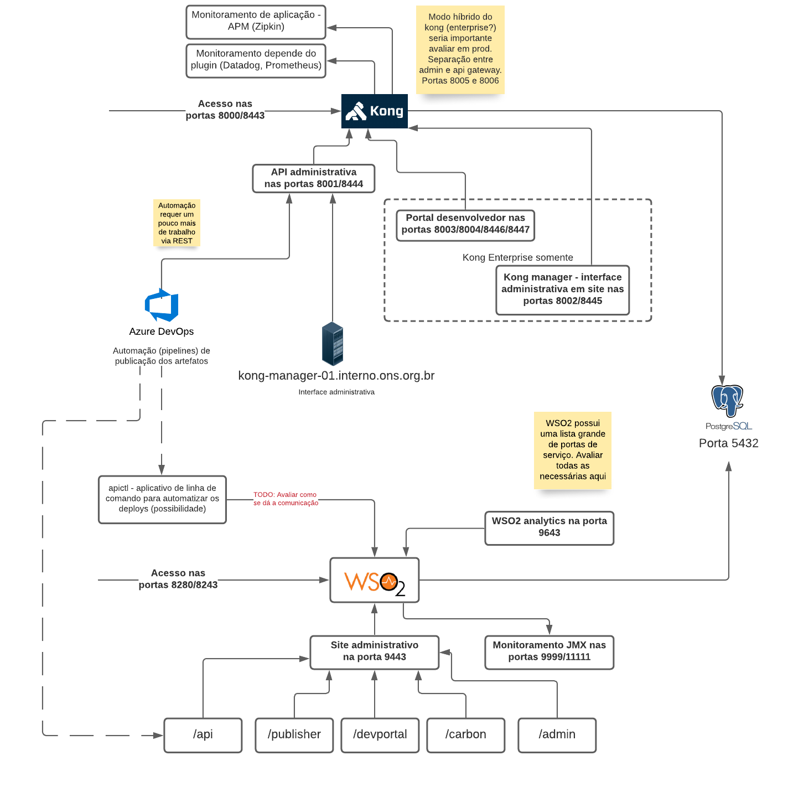

# Implantação em ambiente ONS

**DOCUMENTO PRELIMINAR**

A implantação neste momento ocorre em modelo de prova de conceito (PoC). Como é desejo do ONS ter suporte para o produto, consideramos que o fornecedor, se não executar a instalação, irá fornecer documentos/guias de melhores práticas de implantação.

Neste momento foi solicitado não utilizarmos containers, mas no futuro entendemos que o uso será permitido. O uso de playbooks do Ansible foi recomendada pelo ONS, e é de domínio da equipe da BRQ também

Uma questão em andamento é implantação do kubernetes via OpenShift. Este processo ainda está ocorrendo, mas no entanto já faz sentido levantarmos a infra estrutura atual.

## Componentes

**QUANDO DA FERRAMENTA DEFINIDA, EVOLUIREMOS O DOCUMENTO PARA REFLETIR AS ESPECIFICIDADES**

### Gateway

**INSTALAÇÃO CONFORME O FORNECEDOR**

### Banco de dados

Ambos os finalistas (WSO2 e Kong) podem utilizar PostgreSQL. Instalação via docker nos parece mais recomendado. Seguir recomendação do fornecedor do gateway

Pendências de instalação:
  * Máquina
  * Usuário/senha
  * Permissões adequadas (script SQL a definir)
  * Nome do banco
  * Porta 5432 (padrão) aberta entre os componentes
  * Procedimentos de backup/restore

### Desenho simplificado da estrutura atual

O ONS tem as seguintes separações de rede:

  * DMZ - intermediária entre internet e a rede corporativa
  * CORP - Rede corporativa
  * OPERATIVA - Rede corporativa, segregada

Hoje entre DMZ e CORP existe um servidor nginx atuando como proxy reverso.

Desenho abaixo não reflete os nomes dns reais, somente para entendimento

## Modelo de implantação

Este modelo previu tanto Kong como WSO2

