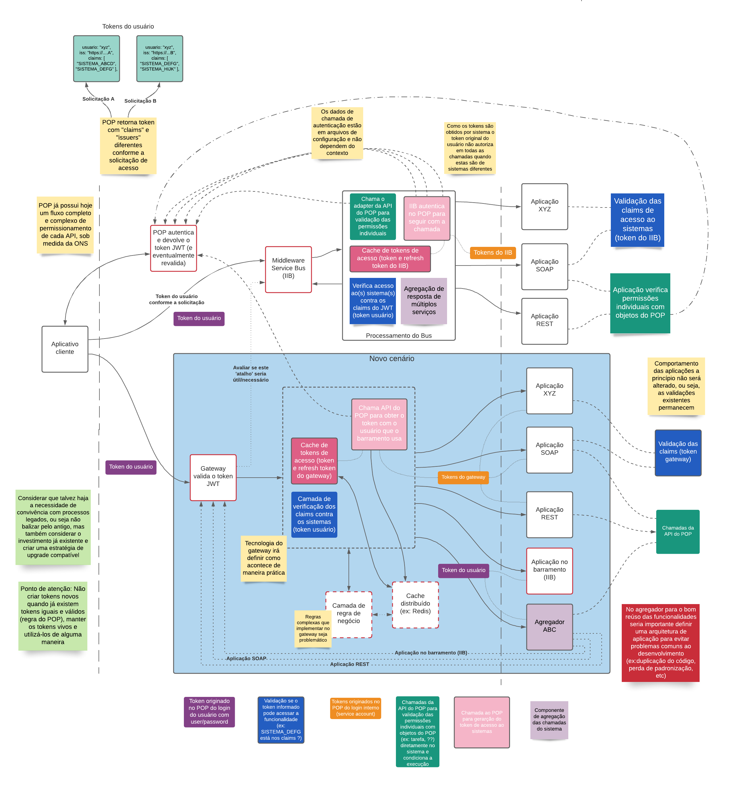
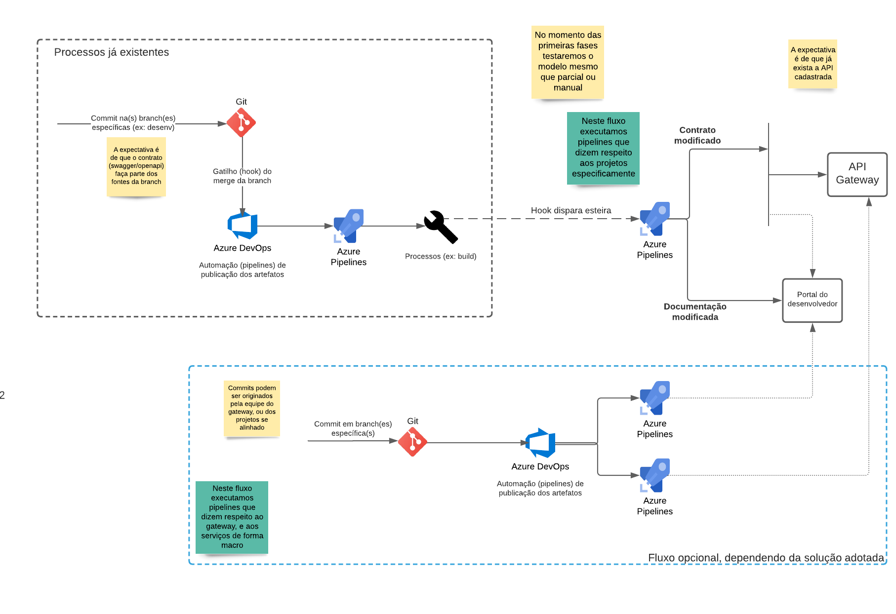
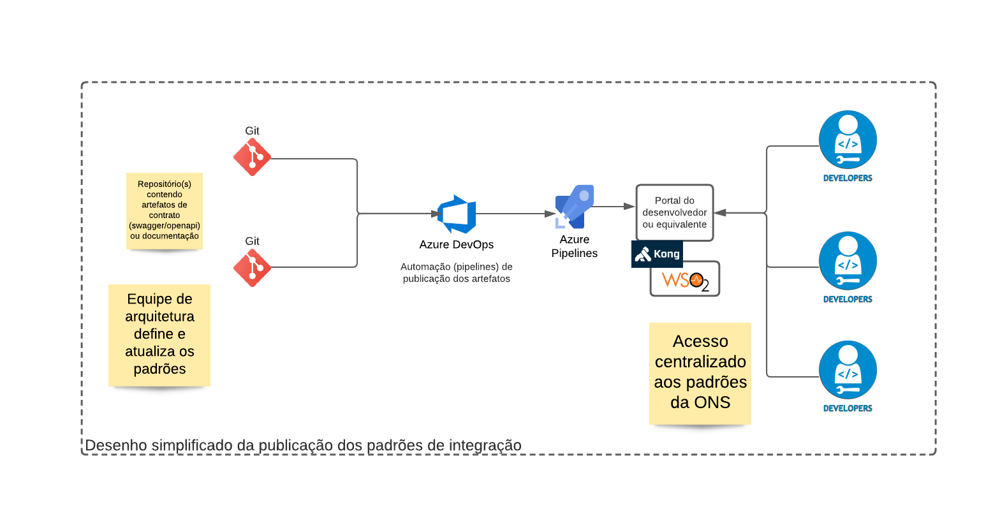
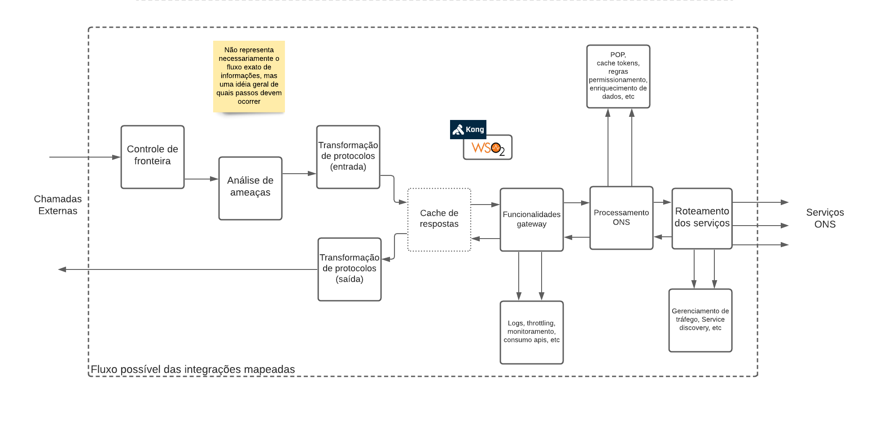

# Arquitetura e padrões

**DOCUMENTO PRELIMINAR**

Neste documento temos a proposta da arquitetura para substituição do IIB, por uma solução de API gateway, levando em consideração o ambiente atual e as necessidades do ONS.

Os desenhos de infra estrutura estão no documento [Implantação em ambiente ONS](ambiente.md)

##  Elementos da arquitetura 

Dividimos os tópicos de arquitetura em partes:

  - Convivência e Integração
  - Fluxo de desenvolvimento e entrega
  - Padronização das aplicações
  - Recursos de Gateway
  - Recursos de Gateway - Portal de desenvolvedor


##  Convivência e Integração 

A arquitetura a ser implementada, precisa contemplar a integração com diversas tecnologias hoje já existentes na ONS

  * POP - Sistema de autenticação/autorização
  * IIB - *Service Bus* da IBM que ainda que seja nosso objetivo substituir, continuará sendo utilizado.

Foi definido como premissa que serviços não chamam nenhum outro serviço diretamente, nem via IIB, sempre pelo Gateway

Existe um cenário que não pode ser coberto pelo gateway, que é o de agregação das chamadas. Hoje os programas do IIB podem efetuar chamadas distintas a serviços distintos, com o intuito de agregar as múltiplas respostas numa só. Este fluxo não faz sentido na solução gateway, já que este produto não é um *Service Bus* ou similar.

Ficou definido neste cenário que estes serviços agregadores, quando necessários, serão construídos na camada de aplicação (em roxo claro), tendo o gateway como porta de entrada, como para quaisquer outros serviços;

##  POP 

O POP é uma solução da ONS que possui duas funções neste contexto:
  * Aplicação Web que permite cadastramento das permissões de acesso (ex: *roles*, grupos, etc)
  * Serviço de autorização: Efetua autenticação no AD (*Active Directory*) e responde com tokens JWT para autorização e autenticação nos sistemas da ONS, e insere no *token* algumas informações de acesso (*scopes/claims*).

Simplificando, podemos entender o papel do POP neste projeto desta maneira:

Cenário A (em branco):
  - Cliente (ex: *front-end*) envia usuário/senha + sistema para acesso
  - POP valida a credencial e devolve o *token* JWT **para aquele sistema** (chamarei aqui de *token* do usuário - em roxo)
Cenário B (em rosa claro):
  - O *token* do usuário não dá acesso ao sistema sendo chamado. Neste caso **a infra estrutura** (hoje IIB, possivelmente o Gateway) tem um cadastro de usuários/senhas para o acesso (estilo *Service Account*), e faz a chamada ao POP.
  - Obtém um *token* para esta chamada (chamarei aqui de *token* do IIB ou Gateway - em laranja)
  - Repete o fluxo para outros sistemas caso seja necessário (já está mapeado que já ocorre hoje no IIB)
Cenário C (em verde):
  - O *token* não possui informação suficiente para decidir se a chamada pode prosseguir. A **aplicação** chama uma API de autorização com os identificadores de recursos pré cadastrados no sistema POP.
  - A API responde concedendo ou não a permissão para prosseguir a chamada

Além do fluxo de criação dos tokens, também é necessário contemplar o fluxo de revalidação (*refresh tokens*), que é feito chamando o POP com este token, de maneira que tanto o *token* quanto os *refresh tokens* serão armazenados pela solução, e já existe uma solução atendendo esta demanda implementada no IIB. 
Existe uma limitação do POP a ser contornada (em rosa escuro): Não devemos criar *tokens* para acesso aos serviços, enquanto ainda existir um *token* válido. Isto implica manter um *cache* destes *tokens* e reaproveitá-los em diferentes chamadas. Coordenar este requisito com a solução IIB. (**A DEFINIÇÃO DESTES FLUXOS DEPENDE AINDA DA SOLUÇÃO ESCOLHIDA**)

De modo geral podemos pensar na execução do serviço da seguinte maneira:
  - De posse do *token* de cliente, este chama a API em dois cenários, legado (IIB) e novo fluxo (API Gateway)
  - No novo fluxo a assinatura do *token* é validada pelo Gateway, e a validação dos claims/scopes verificam se o *token* permite acesso ao sistema sendo chamado (em azul). (**A DEFINIÇÃO DESTE FLUXO DEPENDE AINDA DA SOLUÇÂO ESCOLHIDA**)
  - Gateway efetua validação demais regras (ex: buscar *token* do serviço a ser chamado)
  - Gateway executa a chamada no serviço repassando a informação autorização necessária (*token* do usuário ou do Gateway), conforme necessário

##  IIB 

Não é escopo deste projeto modificar o alterar o funcionamento das soluções IIB, porém será necessário integrar com os serviços existentes, e permitir que os serviços expostos pelo Gateway sejam chamados pelo IIB.

Como já é da natureza dos *Service Bus* efetuarem este tipo de comunicação, entenderemos como ponto pacificado estas integrações. Detalhar o comportamento das aplicações IIB faz parte da proposta de integração, mas fora isso veremos o IIB como "caixa preta" e desenharemos a solução no entorno dele.

##  Desenho 

Abaixo desenho do fluxo de execução pensado:


##  Fluxo de Desenvolvimento e Entrega 

Este fluxo no primeiro momento será validado. Deve atender as especificações já fornecidas pelo ONS, mas somente durante a implantação teremos a real visibilidade se não adicionará complexidade não desejada.

###  Entrega 

A proposta para o desenvolvimento e entrega é a seguinte:

  - Desenvolvimento das aplicações dentro da ONS segue como sem alteração
  - Contratos (swagger/openapi) serão disponibilizados das seguintes maneiras:
     * Arquivos *.yaml/*.json com a definição dos contratos da API, no repositório Git (escopo da 1a fase)
     * Consulta do contrato dentro do fluxo de *deploy* (futuro-a definir)
     * Outras formas a definir
  - Documentos (da API)
     * Estarão disponíveis no repositório Git, no formato Markdown (**DEPENDE DA SOLUÇÃO DEFINIDA**)
  - Rotas ou Hosts (se necessário)
     * Dependendo da solução as rotas ou hosts serão necessárias. Um script irá converter a informação em chamadas da API da ferramenta ou equivalente (**DEPENDE DA SOLUÇÃO DEFINIDA**)
     * Será um repositório único, num formato a definir (**DEPENDE DA SOLUÇÃO DEFINIDA, MAS PODE SER ADIANTADO**)
     * O modelo de governança do repositório precisa atender os futuros desenvolvimentos
  - Esteira de integração do Azure Devops irá publicar os artefatos
     * Publicação do contrato no portal do desenvolvedor
     * Publicação da documentação no portal do desenvolvedor
     * Publicação das rotas/hosts no API Gateway



###  Versionamento 

A proposta de versionamento depende do suporte da ferramenta de gateway. Não possuindo o recurso, podemos atuar na definição de um padrão, e configuração do ferramental neste sentido. Neste caso temos mais uma definição de engenharia de software do que algo relacionado ao projeto em si.

No momento nos parece um recurso para um momento mais maduro do projeto.

(**DEPENDE DA SOLUÇÃO DEFINIDA, NO SENTIDO DE POSSUIR O RECURSO CONTROLÁVEL PELA PLATAFORMA**)

##  Padronização das Aplicações 

Um dos requisitos do projeto, e padronização em torno de um modelo canônico, que já faz parte da arquitetura das aplicações do IIB em produção.

A proposta será de criar uma API referência dentro do portal de desenvolvedor ofertado pela ferramenta selecionada. Teremos um número de contratos que seja ideal para o entendimento dos padrões do ONS e se possível, respostas *mockadas* para exemplificar o uso.

Nestes contratos iremos listar todas as entidades que compõe os sistemas do ONS de maneira que os desenvolvedores possam acessar rapidamente e num ambiente familiar, estas entidades. 

Também deverá ser possível incluir documentação adicional aos contratos, exemplificando por exemplo, o uso das entidades, boas práticas, contato dos responsáveis e urls de acesso dos ambientes, se necessário

Exemplo do yaml do modelo canônico
```yaml
swagger: '2.0'
info:
  description: Api do Sistema x
  version: 1.0.0
  title: sistema-x-api
  contact:
    name: Arquitetura 
    url: 'http://ons.br'
    email: arquitetura@ons.br
  license: 
    name: XXXX
```


##  Recursos de Gateway 

O ONS propôs um conjunto de recursos a serem implementados no projeto. 

Nem todos os produtos possuem suporte aos recursos solicitados, mas na maioria das vezes pareceu ser razoável a implementação pelos mecanismos de extensibilidade das ferramentas. Ainda que seja razoável, alguns deles precisarão de avaliação prática, para sermos assertivos quanto a viabilidade técnica ou prática.

###  Border control (Controle de fronteira)

Ser capaz de não permitir o ingresso de solicitações não permitidas/autorizadas, seja por regras de infra estrutura ou por autorização e autenticação (ex: permissões associadas ao JWT)

Regras de infra estrutura, significa bloquear (blacklist), conceder (whitelist) ou restringir (throttling) acesso conforme alguma regra externa da chamada (ex: endereço IP) ou alguma informação da solicitação (ex: Header HTTP)

Controle de autorização e autenticação: A seção de integração com o POP possui mais detalhes deste processo.

Aqui cabe detalhar que o Gateway deve ser capaz no mínimo de validar a assinatura do token JWT. Para tanto as chaves públicas dos ambientes deverão estar acessíveis ao mesmo.

Na arquitetura do POP hoje, cada ambiente (desenvolvimento, teste e produção), possui uma instância do POP diferente, com chaves de assinatura diferentes. Estas chaves hoje estão no repositório do POP. Nossa proposta seria a integração por esteira do Azure Devops **VALIDAR A POSSIBILIDADE**.

A validação dos *claims/scopes* e como se configura, depende da ferramenta. **DEPENDE DA FERRAMENTA, POIS A ASSOCIAÇÃO DOS SERVIÇOS PERMITIDOS CONTRA OS CONTRATOS E ROTAS, HOJE ESTÁ NO IIB**

###  Customs examination (Análise de ameaças) 

**DEPENDE DA FERRAMENTA, NO SENTIDO QUE JÁ PODE EXISTIR O RECURSO NA PLATAFORMA, E DE COMO SERÁ INTEGRADO**

Proteção contra ameaças - neste sentido, entendemos como validar os dados das chamadas (*payloads*), buscando abordagens já conhecidas de *hackers* para acesso/alterações/roubo das informações dos serviços.

  * Por expressões regulares: buscar conteúdos conhecidos (ex: SQL Injection)
  * Validadores (ex: JSON e XML): por conteúdo "mal formado" com intuito de explorar falha nas bibliotecas das aplicações
  * Detector de BOTs: BOTs de hackers buscam por tentativa/erro falhas conhecidas nas aplicações

Consideramos usar o recurso já disponível que alguns dos gateways oferecem. Implementação pelo modelo de extensibilidade deve possível.

Este recurso em geral afeta significativamente a performance do gateway, já que todas as chamadas serão analisadas. Se possível definir uma abordagem com intuito de minimizar as validações.

###  Transformações do protocolo 

**DEPENDE DA FERRAMENTA**

Será necessário transformar os dados de entrada (*payloads*) entre tecnologias incompatíveis (ex: SOAP/XML vs REST/JSON). A idéia é termos alguns **transformadores** que serão aplicados na chamada e na resposta de maneira a adequar as tecnologias.

Nas discussões com ONS ficou claro que a solução API gateway não pode ser transformar em outro IIB, de maneira que a solução deve ser simples. 

Depende da ferramenta a mecânica de funcionamento, linguagem de desenvolvimento e método de implantação, de maneira que só temos a estratégia neste momento.

###  Traffic Management (Gerenciamento de Tráfego ) 

**DEPENDE DA FERRAMENTA, NO SENTIDO QUE PODEM EXISTIR RECURSOS MAIS SOFISTICADOS**

As abordagens de distribuição do tráfego existem nos gateways, mas em geral são simples, em tese a camada de rede deveria distribuir por meio de balanceador de carga ou equivalente. 

Alguns possuem mecanismos mais sofisticados de tolerância a falha (ex: rotas alternativas, ou respostas pré-determinadas)

Com o uso do Openshift seria interessante num primeiro momento delegar para a estrutura de *Service* do Kubernetes esta responsabilidade.

###  Monitoramento 

**DEPENDE DA FERRAMENTA**

A geração de dados a serem consumidos por ferramentas de monitoramento dependem da ferramenta.

  * Configuração da geração
  * Ativação de plugins



###  API economy (monitoria do consumo de APIs) 

**DEPENDE DA FERRAMENTA, NO SENTIDO DE COMO IREMOS CONFIGURAR**

Podemos separar os chamadores por chaves de API distintas, com o intuito de diferenciar os chamadores, limitar acesso à recursos, entre outras possibilidades.

Esta estrutura prevemos avaliar num segundo momento, pois os recursos permitidos em particular, dependem do ferramental

###  Suporte ao GraphQL 

**DEPENDE DA FERRAMENTA, NO SENTIDO DE COMO FACILITA O DESENVOLVIMENTO**

Neste fluxo pode ter suporte no gateway ou no portal de desenvolvedor.

Ainda não existe aplicação GraphQL no ONS, de modo que quando definida a ferramenta, definiremos os recursos a serem utilizados.

##  Recursos de Gateway - Portal de desenvolvedor  

###  Pesquisa inversa dos contratos do gateway 

**DEPENDE DA FERRAMENTA, NO SENTIDO QUE JÁ PODE EXISTIR O RECURSO NA PLATAFORMA**

É desejável ser capaz de efetuar a pesquisa inversa, em que à partir do item do modelo canônico, encontremos todas as APIs que utilizam este item. 

Ainda não temos a certeza se as plataformas implementam esta funcionalidade. A rigor poderia ser desenvolvida com *plugin* do portal de desenvolvimento, mas algo fora do escopo atual.

###  Geração de mocks 

**DEPENDE DA FERRAMENTA, NO SENTIDO QUE JÁ PODE EXISTIR O RECURSO NA PLATAFORMA**

A proposta neste momento é reutilizar a *feature* da própria ferramenta se existir.

No caso de não termos este recurso, é possível desenvolver um gerador à partir da definição dos contratos. Entendemos que podemos utilizar esta abordagem em uma fase mais adiante do projeto.

###  Swagger/OpenAPI 

**DEPENDE DA FERRAMENTA, NO SENTIDO DE COMO INTEGRAR**

A ferramenta de portal de desenvolvedor disponibilizará os contratos, de maneira que precisamos integrar com o fluxo de publicação desta mesma ferramenta.

No primeiro momento podemos integrar via scripts somente, para validar o processo. Ainda assim, dependemos do ferramental da aplicação para a conclusão.
